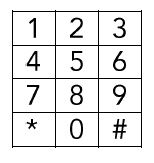

# chess-on-phone-keypad 

- The following diagram is of a standard telephone keypad - it consists of a 4x3 grid of buttons.
- Using the valid moves of a piece from the game of chess, varying combinations of 7-digit phone numbers can be derived.
- For example, starting in the upper-right corner (the '3' key) using a rook (which moves any number of spaces horizontally or vertically), one valid number, after pressing the initial '3' key is: <b>`314-5289`</b>.

<p></p>

## problem

Write a program that will count the number of valid 7-digit phone numbers that can be traced out on the keypad for every given chess piece.

The following rules define a valid phone number.
- Seven digits in length.
- Cannot start with a <b>`0`</b> or <b>`1`</b>.
- Cannot contain a <b>`*`</b> or <b>`#`</b>.

## results
Total valid 7-digit phone numbers for each standard chess pieces as follows.
```
King : 124908
Queen : 751503
Bishop : 2341
Knight : 952
Rook : 49326
Pawn : 0
```
## comments
- The current solution can be modified to use any layout and not just a 4x3 grid.
- If a different layout is used, the 'names' of the characters/digits appearing on each grid box will need to be provided, in a left to right order as they would appear on the grid, starting from the first row.
- The solution can also be easily modified to ignore any characters in any grid boxes which you do not want to be included in the path traversals.
- The solution can cater for more than 7-digit phone numbers, however after a certain limit, the data returned will show up as exponential values.
- If you go further, then the `double` datatype used to return the result-set, will overflow and you will start seeing unexpected results.